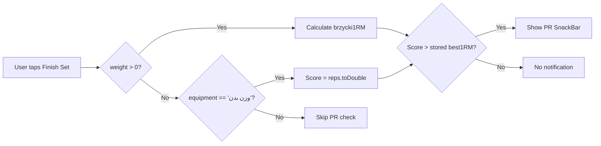

# EXO — System State Analysis & Knowledge Base v2.0

> **Generated**: 2026-05-19  
> **Phase**: 1 Complete (Navigation, State, Form, PR refactoring)  
> **Status**: `flutter analyze` — 0 errors  

---

## 1. Updated Architecture Overview

### 1.1 High-Level Layer Diagram

```
┌─────────────────────────────────────────────────────────────────────┐
│  PRESENTATION LAYER                                                 │
│  ┌─────────────────────────────────────────────────────────────┐   │
│  │  Screens (ConsumerWidget / ConsumerStatefulWidget)           │   │
│  │  Router: GoRouter + StatefulShellRoute.indexedStack         │   │
│  └─────────────────────────────────────────────────────────────┘   │
├─────────────────────────────────────────────────────────────────────┤
│  STATE LAYER (Riverpod 2.x Code Gen)                                │
│  ┌──────────┐ ┌──────────────┐ ┌────────────────┐ ┌─────────────┐  │
│  │ Workout  │ │ ActiveWorkout│ │ Analytics      │ │ AddExercise │  │
│  │ Notifier │ │ Notifier     │ │ Notifier       │ │ FormNotifier│  │
│  │ (keepA.) │ │ (keepAlive)  │ │ (keepAlive)    │ │ (auto-disp) │  │
│  └────┬─────┘ └──────┬───────┘ └───────┬────────┘ └──────┬──────┘  │
│       │              │                 │                 │          │
│  ┌────┴──────────────┴─────────────────┴─────────────────┴──────┐  │
│  │  Family / Provider / Select providers (exerciseAnalytics,   │  │
│  │  mediaRepository, storage, TTS, music, weight)              │  │
│  └─────────────────────────────────────────────────────────────┘  │
├─────────────────────────────────────────────────────────────────────┤
│  DOMAIN LAYER                                                       │
│  ┌─────────────────────────────────────────────────────────────┐   │
│  │  Services: AnalyticsService, WorkoutStateManager            │   │
│  │  Repository Interfaces: WorkoutRepository, MediaRepository,│   │
│  │                        MusicRepository                     │   │
│  │  Models: Exercise, WorkoutPlan, WorkoutLog, SetLog,        │   │
│  │          PersonalRecord, ExerciseMedia, BodyWeightRecord   │   │
│  └─────────────────────────────────────────────────────────────┘   │
├─────────────────────────────────────────────────────────────────────┤
│  DATA LAYER                                                        │
│  ┌─────────────────────────────────────────────────────────────┐   │
│  │  Hive Adapters (7 total)                                    │   │
│  │  Repository Implementations (WorkoutRepositoryImpl, etc.)   │   │
│  │  Storage Providers (appBox, snapshotBox)                    │   │
│  └─────────────────────────────────────────────────────────────┘   │
└─────────────────────────────────────────────────────────────────────┘
```

### 1.2 Navigation Architecture (GoRouter)

Routing is **fully declarative**, configured in `lib/router/app_router.dart` via a `@riverpod` provider.

**Shell Route (4 tabs) — `StatefulShellRoute.indexedStack`:**

| Branch   | Path          | Screen                  |
| -------- | ------------- | ----------------------- |
| Dashboard | `/dashboard` | `DashboardScreen`      |
| History  | `/history`    | `WorkoutHistoryScreen` |
| Editor   | `/editor`     | `PlanEditorScreen`     |
| Profile  | `/profile`    | `ProfileScreen`        |

**Top-Level Routes** (outside the shell, no bottom tab persistence):

| Route                        | Path                         | Screen                      | Parameter          |
| ---------------------------- | ---------------------------- | --------------------------- | ------------------ |
| Active Workout               | `/active-workout/:dayId`     | `ActiveWorkoutScreen`       | `dayId` (path)     |
| Rest Timer                   | `/rest`                      | `RestScreen`                | —                  |
| Add Exercise                 | `/add-exercise`              | `AddExerciseScreen`         | —                  |
| Create Plan                  | `/create-plan`               | `CreatePlanScreen`          | —                  |
| Day Detail                   | `/day-detail/:dayId`         | `DayDetailScreen`           | `dayId` (path)     |
| Exercise Analytics           | `/exercise-analytics/:exerciseId` | `ExerciseAnalyticsScreen` | `exerciseId` (path), `exerciseName` (extra) |

**Key Design Decisions:**
- `RestScreen` is a **fullscreen dialog** (`CustomTransitionPage` with `fullscreenDialog: true`) via `pageBuilder`, not nested under `ActiveWorkoutScreen`. This allows the rest timer to overlay independently while the active workout state persists in the keepAlive provider.
- `ExerciseAnalyticsScreen` receives `exerciseName` via `state.extra` (runtime `String?`) rather than a path parameter, keeping URLs clean while optionally passing the display name.
- The redirect guard at `/` → `/dashboard` ensures the initial location always lands on the shell's first tab.
- Navigation calls use GoRouter extensions exclusively: `context.push(...)`, `context.pop()`, `context.go(...)`. No imperative `Navigator.of(context)` remains.

---

## 2. State Management Map

### 2.1 Provider Inventory

| Provider                    | Type            | KeepAlive | Scope           | Dependencies                         |
| --------------------------- | --------------- | --------- | --------------- | ------------------------------------ |
| `workoutNotifierProvider`   | AsyncNotifier   | ✅ Yes    | App-wide        | `WorkoutRepository` (Hive)           |
| `activeWorkoutNotifierProvider` | Notifier    | ✅ Yes    | App-wide        | `workoutNotifierProvider`, `TTS`, `Music`, `snapshotBox` |
| `analyticsNotifierProvider` | Notifier        | ✅ Yes    | App-wide        | `workoutNotifierProvider` (via `select` on `workoutLogs`) |
| `exerciseAnalyticsProvider` | Family Provider | ❌ No    | Per-exercise   | `workoutNotifierProvider` (via `select` on `workoutLogs`) |
| `addExerciseFormNotifierProvider` | Notifier | ❌ No    | Per-screen     | `workoutNotifierProvider` (via `ref.read` in `build()`) |
| `routerProvider`            | Provider        | ❌ No    | App-wide        | —                                    |
| `mediaRepositoryProvider`   | Provider        | ❌ No    | DI             | —                                    |
| `musicProviderProvider`     | Notifier        | ✅ Yes    | App-wide        | `MusicRepository`                    |
| `tTSServiceProvider`        | Notifier        | ✅ Yes    | App-wide        | —                                    |
| `weightLogNotifierProvider` | Notifier        | ✅ Yes    | App-wide        | Hive (body weight box)               |
| `appBoxProvider`            | Provider        | ❌ No    | DI (overridden) | Hive                                 |
| `snapshotBoxProvider`       | Provider        | ❌ No    | DI (overridden) | Hive                                 |

### 2.2 Provider Interaction Graph

```
┌──────────────────┐      ┌──────────────────────┐
│  WorkoutNotifier │◄────►│   ActiveWorkout       │
│  (Plans + Logs)  │      │   Notifier            │
│  keepAlive       │      │  (Session + Rest)     │
└────┬──────┬──────┘      │  keepAlive            │
     │      │             └──────────────────────┘
     │      │
     │      └──reads──────┐
     │                    ▼
     │         ┌──────────────────────┐
     │         │  AnalyticsNotifier   │
     │         │  (PRs, Best Lifts)   │
     │         │  keepAlive           │
     │         └──────────┬───────────┘
     │                    │
     │         ┌──────────▼───────────┐
     │         │ exerciseAnalytics    │
     │         │ (Per-exercise chart) │
     │         │ auto-dispose family  │
     │         └──────────────────────┘
     │
     └──reads──┐
               ▼
     ┌──────────────────────┐
     │ AddExerciseForm      │
     │ Notifier             │
     │ auto-dispose         │
     └──────────────────────┘
```

**Key interaction points:**

1. **WorkoutNotifier → ActiveWorkoutNotifier**: `completeDay()` creates a `WorkoutLog` from session data and prepends it to `workoutLogs`. The active workout never directly reads the workout logs.

2. **WorkoutNotifier → AnalyticsNotifier**: `AnalyticsNotifier.build()` watches `workoutNotifierProvider.select((s) => s.valueOrNull?.workoutLogs)` — it only rebuilds when the logs array identity changes, not on plan/day changes. This was a **critical bug fix in Prompt 2**: previously `ref.watch(workoutNotifierProvider).whenOrNull(data: ...)` was called but the return value was discarded, meaning `AnalyticsState` was **always** `const AnalyticsState()` with empty maps, causing PR badges to never render.

3. **WorkoutNotifier → AddExerciseFormNotifier**: The form notifier reads `ref.read(workoutNotifierProvider).valueOrNull` in its `build()` to initialize `selectedDayId` from the current plan. It does NOT subscribe — it's a one-time initialization for a disposable form.

4. **ActiveWorkoutNotifier → WorkoutNotifier**: On `completeDay()`, the active workout calls `ref.read(workoutNotifierProvider.notifier).completeDay(...)`, which triggers the full log-and-advance flow. The active workout then resets to initial state.

### 2.3 Select Optimization Map

| Watcher Site               | Full Provider Watch (Before)          | Optimized Select (After)                 |
| -------------------------- | ------------------------------------- | ---------------------------------------- |
| `AnalyticsNotifier.build()` | `workoutNotifierProvider`             | `select((s) => s.valueOrNull?.workoutLogs)` |
| `exerciseAnalyticsProvider` | N/A (new in Prompt 2)                | `select((s) => s.valueOrNull?.workoutLogs)` |
| `DashboardScreen._ExerciseListView` | `activeWorkoutNotifierProvider` (3 uses) | 3 separate selects: `hasDay`, `dayId`, `currentSessionData` |
| `_DayNavigationBar`         | Already optimized ✓                  | `select((s) => s.valueOrNull?.currentDayIndex)` |
| `_ProgressBar`              | Already optimized ✓                  | `select((s) => s.valueOrNull?.completedDaysCount)` and `totalDays` |

---

## 3. Data Flow & Persistence

### 3.1 Hive Box Layout

Two Hive boxes are opened at startup in `main.dart`:

| Box Name                  | Key                    | Contents                          | Adapter         |
| ------------------------- | ---------------------- | --------------------------------- | --------------- |
| `app_data`                | `workout_plans`        | `List<WorkoutPlan>`               | typeId 3        |
|                           | `active_plan_id`       | `String?`                         | —               |
|                           | `current_day_index`    | `int?`                            | —               |
|                           | `workout_logs`         | `List<WorkoutLog>`                | typeId 4        |
| `active_workout_snapshot` | `dayId`                | `String?`                         | —               |
|                           | `currentExerciseIndex` | `int?`                            | —               |
|                           | `currentSet`           | `int?`                            | —               |
|                           | `remainingRestSeconds` | `int?`                            | —               |
|                           | `workoutStartTime`     | `int?` (epoch ms)                 | —               |
|                           | `sessionData`          | `Map<String, List<Map>>` (serialized `SetLog`s) | — |

**7 Hive TypeAdapters registered**: `ExerciseMedia` (0), `Exercise` (1), `WorkoutDay` (2), `WorkoutPlan` (3), `WorkoutLog` (4), `SetLog` (5), `ExercisePerformance` (6).

**Error recovery**: Both boxes have a try/catch/delete-and-reopen fallback in `main.dart`. If a box is corrupted, it is deleted and recreated fresh.

### 3.2 Data Flow: Starting a Workout → Completing It

```
1. User taps "Start Workout" on DashboardScreen
   → context.push('/active-workout/:dayId')
   → ActiveWorkoutScreen builds
   → ShellScreen calls provider.startWorkout(day)

2. ActiveWorkoutNotifier.startWorkout(day)
   → Sets dayId, exercises, currentExerciseIndex=0, currentSet=1
   → Starts background music if available

3. User performs sets
   → updateSetData(exerciseId, setNumber, reps, weight, isCompleted)
   → Early-returns if SetLog unchanged (performance optimization from Prompt 2)
   → Copies only the changed List<SetLog> for the affected exercise

4. User taps "Finish Set"
   → finishSet() called
   → If currentSet < exercise.sets: advance set, start rest timer
   → If currentSet >= exercise.sets: advance to next exercise
   → If all exercises complete: state.isAllDone = true

   PR Check (on Finish Set button, in ActiveWorkoutScreen):
     weight > 0 || exercise.equipment == 'وزن بدن'
       → _checkForPR(exercise, weight, reps)
         → analyticsNotifierProvider.notifier.isNewPR(...)
           → AnalyticsService.isRecordForExercise(estimated1RM, existing.best1RM)

5. User completes workout
   → ActiveWorkoutScreen calls provider.finishWorkout()
   → Then calls ref.read(workoutNotifierProvider.notifier).completeDay(...)
   → WorkoutNotifier creates WorkoutLog, prepends to workoutLogs, saves to Hive
   → ActiveWorkout clears snapshot, resets to initial state
```

### 3.3 PR Calculation: Bodyweight vs Weighted

**Critical distinction introduced in Prompt 4:**



**`brzycki1RM` formula:**
```dart
if (weight == 0) return reps.toDouble();          // Bodyweight: score by reps
if (reps <= 0 || reps >= 36) return weight;       // Edge case: return raw weight
return weight * (36.0 / (37.0 - reps));            // Standard Brzycki formula
```

**Key insight**: Before Prompt 4, `brzycki1RM` returned `0` when `weight == 0`, so bodyweight exercises (push-ups, pull-ups, etc.) could NEVER trigger a PR. Now they score by maximum reps, allowing progression tracking for calisthenic movements.

**Limitation still present**: The `AnalyticsService.bestLifts` getter still filters `set.weight <= 0` at line 46 and 76-77, meaning bodyweight PRs are tracked via the Finish Set snackbar but do NOT appear in the analytics dashboard's `bestLifts` map or exercise chart data. This is acceptable for v1 — bodyweight exercises benefit from real-time PR feedback while weighted exercises remain the focus of historical analytics.

### 3.4 `updateSetData` Performance Profile

**Optimization from Prompt 2:**

Before (every button press):
```dart
final current = Map<String, List<SetLog>>.from(state.currentSessionData);  // Copy ALL exercises
final existingSets = List<SetLog>.from(current[exerciseId] ?? []);          // Copy the list
// ... modify ...
state = state.copyWith(currentSessionData: current);
```

After:
```dart
final existingSets = state.currentSessionData[exerciseId] ?? const [];      // No copy
final setIndex = existingSets.indexWhere(...);
if (setIndex >= 0 && existingSets[setIndex] == newSetLog) return;           // Early return
final newSets = List<SetLog>.from(existingSets);                             // Copy only this list
state = state.copyWith(currentSessionData: {...state.currentSessionData, exerciseId: newSets});  // Shallow map copy
```

**Profile**: Called once per set completion (button press, ~6–9 times per exercise). Not a hot path, but the optimization prevents unnecessary Notifier rebuilds and is structurally cleaner.

---

## 4. Current Limitations

### 4.1 100% Offline Architecture

The app is **entirely local-first** with no network layer:

- All data lives in Hive boxes on-device.
- No user authentication or account system.
- No cloud backup or cross-device sync.
- No remote logging or analytics.
- No over-the-air updates or feature flags.
- No server-side PR validation or leaderboard.

### 4.2 Tight Hive Coupling

The `WorkoutRepositoryImpl` directly depends on a `hive` `Box`:

```dart
class WorkoutRepositoryImpl with ErrorHandlerMixin implements WorkoutRepository {
  final Box _appBox;              // ← Hive-specific type
  // ...
}
```

The `@riverpod` factory at the bottom of the file:
```dart
@riverpod
WorkoutRepository workoutRepository(WorkoutRepositoryRef ref) {
  final box = ref.watch(appBoxProvider);    // ← Hive Box injected at app startup
  return WorkoutRepositoryImpl(box);
}
```

This means the entire app's data layer collapses if the Hive box is unavailable or corrupt. While there is a delete-and-reopen fallback in `main.dart`, this destroys user data.

### 4.3 No Separation Between Read/Write Models

The same `WorkoutPlanState` class is used for:
- Reading plan structure (days, exercises, equipment)
- Reading workout logs (history, analytics)
- Writing plan modifications (add/remove exercises)

This creates a "God State" pattern where `WorkoutNotifier` manages all plan and log mutations through a single state class. CQRS separation would allow independent caching strategies for read-heavy vs write-heavy operations.

### 4.4 Snapshot Mechanism Is Fragile

The active workout snapshot in `active_workout_snapshot` Hive box:
- Serializes `SetLog` objects manually via `.toMap()` / `fromMap()`.
- Has no versioning — if the `SetLog` schema changes, restored snapshots may silently lose fields.
- No TTL or stale-snapshot cleanup.
- The lifecycle listener (`AppLifecycleListener`) only persists on `paused`/`inactive` and restores on `build()`. If the app is force-killed between state changes, the snapshot may be partial.

### 4.5 Analytics Scaling

`AnalyticsService` recomputes `bestLifts` and `exercisesWithPRs` from scratch every time `AnalyticsNotifier` rebuilds. With 100+ workout logs, this could become slow on low-end devices. There is no caching, memoization, or incremental update strategy.

---

## 5. Injection Points for Future Backend

### 5.1 Repository Layer (Primary Refactoring Target)

The abstract `WorkoutRepository` interface (`lib/domain/repositories/workout_repository.dart`) is the **natural seam for backend integration**. Current interface:

```dart
abstract class WorkoutRepository {
  Future<Result<List<WorkoutPlan>>> loadPlans();
  Future<Result<String?>> getActivePlanId();
  Future<Result<int?>> getCurrentDayIndex();
  Future<Result<List<WorkoutLog>>> loadLogs();
  Future<Result<void>> savePlans(List<WorkoutPlan> plans);
  Future<Result<void>> saveActivePlanId(String planId);
  Future<Result<void>> saveCurrentDayIndex(int dayIndex);
  Future<Result<void>> saveLogs(List<WorkoutLog> logs);
  Future<Result<void>> clearAll();
}
```

**What an API implementation needs to add:**

| Missing Method                     | Why Needed                                    |
| ---------------------------------- | --------------------------------------------- |
| `Future<Result<UserProfile>> getUser()` | Authentication, preferences sync          |
| `Future<Result<void>> syncAll()`       | Two-way sync between local Hive and remote |
| `Future<Result<DateTime>> lastSync()`  | Conflict resolution, dirty tracking        |
| `Future<Result<void>> uploadLog(WorkoutLog)` | Real-time workout sharing           |
| `Future<Result<List<WorkoutTemplate>>> fetchTemplates()` | Community/suggested plans  |

**Strategy recommendation:** Implement a `SyncingWorkoutRepository` decorator that wraps both a `LocalWorkoutRepositoryImpl` (Hive) and a `RemoteWorkoutRepositoryImpl` (API):

```dart
class SyncingWorkoutRepository implements WorkoutRepository {
  final WorkoutRepository local;
  final WorkoutRepository remote;
  // Write-through: save locally + queue for remote
  // Read: serve from local, background sync from remote
}
```

### 5.2 Provider Layer (Minimal Changes Needed)

The Riverpod providers are **already clean** — they depend on abstract interfaces, not concrete implementations. The change is as simple as swapping the `@riverpod` factory:

```dart
// Current (Hive only):
@riverpod
WorkoutRepository workoutRepository(WorkoutRepositoryRef ref) {
  final box = ref.watch(appBoxProvider);
  return WorkoutRepositoryImpl(box);
}

// Future (syncing):
@riverpod
WorkoutRepository workoutRepository(WorkoutRepositoryRef ref) {
  final local = WorkoutRepositoryImpl(ref.watch(appBoxProvider));
  final remote = ApiWorkoutRepository(/* api client */);
  return SyncingWorkoutRepository(local: local, remote: remote);
}
```

**Providers that need NO changes** (they depend only on abstract interfaces):

| Provider                    | Dependency              | Change Required for Backend      |
| --------------------------- | ----------------------- | -------------------------------- |
| `workoutNotifierProvider`   | `WorkoutRepository`     | Only swap the DI factory         |
| `activeWorkoutNotifierProvider` | `WorkoutNotifier`  | None (no direct DB access)      |
| `analyticsNotifierProvider` | `WorkoutNotifier`      | None (reads from state)          |
| `addExerciseFormNotifierProvider` | `WorkoutNotifier`  | None                             |

### 5.3 Storage Providers (App Startup)

`lib/providers/storage_providers.dart` currently uses `throw UnimplementedError()` for the Hive box providers. These are overridden at `runApp()` in `main.dart`. For a backend-enabled app:

```dart
// Keep local Hive for offline-first, add remote:
@riverpod
ApiClient apiClient(ApiClientRef ref) {
  return ApiClient(baseUrl: AppConfig.apiBaseUrl);
}
```

### 5.4 Models (Serialization)

All domain models already have `.toMap()` / `fromMap()` methods, making JSON serialization straightforward. No changes needed. Example:

```dart
// Exercise already serializes to/from Map:
Map<String, dynamic> toMap();
factory Exercise.fromMap(Map<String, dynamic> map);
```

A production backend would need:
- A `toJson() => jsonEncode(toMap())` / `fromJson()` wrapper.
- API-specific fields: `serverId`, `syncStatus`, `lastModified`.
- Conflict resolution strategy (last-write-wins vs. timestamp merging).

### 5.5 Media & File Management

`MediaRepository` is already properly abstracted:
```dart
abstract class MediaRepository {
  Future<String?> pickAndSaveMedia();
}
```

For cloud sync, extend with:
```dart
abstract class MediaRepository {
  Future<String?> pickAndSaveMedia();
  Future<String?> uploadMedia(String localPath);     // NEW
  Future<void> downloadMedia(String remoteUrl, String localPath);  // NEW
}
```

### 5.6 Recommended Backend Integration Order

| Step | What                         | Effort | Risk  |
| ---- | ---------------------------- | ------ | ----- |
| 1    | Add `Result`-wrapped API client provider | Low | Low |
| 2    | Implement `RemoteWorkoutRepository` (read-only) | Medium | Low |
| 3    | Add `SyncingWorkoutRepository` decorator | Medium | Medium |
| 4    | Add user auth provider + guard to router | High | High |
| 5    | Implement write path (plan/log sync) | High | High |
| 6    | Media upload/download for exercise assets | Medium | Medium |

---

## Summary of Phase 1 Changes

| Prompt | Scope                            | Files Changed | Key Impact                               |
| ------ | -------------------------------- | ------------- | ---------------------------------------- |
| 1      | GoRouter Navigation Migration    | 10            | Removed all `Navigator.of(context)` calls; declarative routing with `StatefulShellRoute` |
| 2      | State Management Performance     | 5             | Fixed `AnalyticsState` bug (state always empty); `select()` optimization; `updateSetData` early return |
| 3      | Form State Migration & Calendar  | 4             | New `AddExerciseFormNotifier` (auto-dispose); removed 6 controllers from screen; fixed calendar overflow |
| 4      | Equipment-based PR & Inputs      | 3             | Bodyweight PR calculation (`brzycki1RM` 0-weight fix); dynamic weight/tension labels per equipment type |

**Analysis debt**: None. `flutter analyze` passes with 0 errors. The 2 info-level `use_build_context_synchronously` lints on `active_workout_screen.dart` are pre-existing and guarded by `context.mounted` checks.
